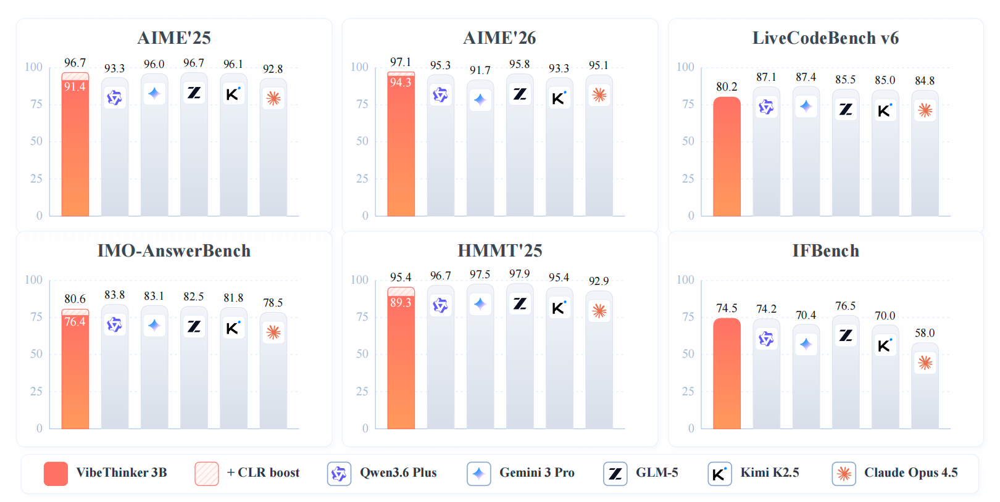

# VibeThinkerModel

<p align="center"></p>

<p align="center">
  <a href="https://github.com/OMCHOKSI108/VibeThinkerModel">GitHub</a>&nbsp;&nbsp;|&nbsp;&nbsp;
  <a href="https://huggingface.co/OMCHOKSI108/VibeThinker-3B">HF Mirror</a>&nbsp;&nbsp;|&nbsp;&nbsp;
  <a href="https://github.com/WeiboAI/VibeThinker">Original GitHub</a>&nbsp;&nbsp;|&nbsp;&nbsp;
  <a href="https://huggingface.co/WeiboAI/VibeThinker-3B">Original HF</a>
</p>

---

**This repository is a documented fork/mirror of [WeiboAI/VibeThinker](https://github.com/WeiboAI/VibeThinker) for learning, experimentation, and structured usage.**

It provides improved documentation, a structured project overview, setup guides, inference examples, and attribution. No model weights have been modified.

---

## What is VibeThinker?

VibeThinker is a family of dense reasoning models developed by WeiboAI to explore how far verifiable reasoning can be pushed in small-model regimes. Two variants are available:

| Model | Parameters | Base Model | Technical Report |
|-------|-----------|------------|-----------------|
| VibeThinker-3B | 3B | Qwen2.5-Coder-3B | [arXiv](https://arxiv.org/pdf/2606.16140) |
| VibeThinker-1.5B | 1.5B | Not specified in original source | [arXiv](https://arxiv.org/abs/2511.06221) |

### VibeThinker-3B

VibeThinker-3B is a 3-billion-parameter dense reasoning model developed to explore how far verifiable reasoning can be pushed within a strictly small-model regime. It is built upon Qwen2.5-Coder-3B and post-trained with an upgraded Spectrum-to-Signal pipeline that combines curriculum-based supervised fine-tuning, multi-domain reinforcement learning, offline self-distillation, and instruction-oriented reinforcement learning.

The model is designed for tasks with reliable verification signals, including mathematical reasoning, competitive programming, STEM reasoning, and instruction-following with explicit constraints. The technical report shows that VibeThinker-3B can reach frontier-level performance on several verifiable reasoning benchmarks while remaining much smaller than typical frontier reasoning systems.

<p align="center"></p>

### VibeThinker-1.5B

VibeThinker-1.5B is a 1.5B-parameter dense model that challenges the prevailing notion that small models inherently lack robust reasoning capabilities. Developed with an innovative post-training methodology centered on the **"Spectrum-to-Signal Principle (SSP)"**, VibeThinker-1.5B demonstrates superior reasoning capabilities compared to closed-source models Magistral Medium and Claude Opus 4, while achieving performance on par with open-source models like GPT OSS-20B Medium.

Most remarkably, VibeThinker-1.5B surpasses the initial DeepSeek R1 model, which is over 400 times larger, across three challenging mathematical benchmarks: AIME24 (80.3 vs. 79.8), AIME25 (74.4 vs. 70.0), and HMMT25 (50.4 vs. 41.7).

<p align="center"></p>

## Key Features

### VibeThinker-3B

- **Ultra-Efficient Frontier-Level Reasoning**: With only **3B parameters**, VibeThinker-3B approaches the performance range of much larger frontier reasoning systems. It matches or closely trails models that are orders of magnitude larger on challenging reasoning benchmarks, demonstrating that compact models can encode high-density reasoning ability when trained with reliable verifiable signals.

<p align="center"></p>

- **Outstanding Capabilities Across Benchmarks**: VibeThinker-3B delivers strong and balanced performance across mathematics, coding, and out-of-distribution evaluation. It achieves **94.3** on AIME26, **89.3** on HMMT25, **80.2 Pass@1** on LiveCodeBench v6, and a **96.1%** acceptance rate on recent unseen LeetCode weekly and biweekly contests from Apr. 25 to May 31, 2026.

<p align="center"></p>

- **Upgraded SSP Training Paradigm**: VibeThinker-3B systematically upgrades the Spectrum-to-Signal Principle introduced in VibeThinker-1.5B. The post-training pipeline strengthens data synthesis, quality filtering, and curriculum learning in SFT, extends MGPO-style RL to multiple verifiable domains, preserves complete long-context reasoning trajectories, and consolidates capabilities through offline self-distillation and Instruct RL.

<p align="center"></p>

- **Inference-Time Scaling with CLR**: VibeThinker-3B introduces Claim-Level Reliability Assessment (CLR), a test-time scaling strategy for answer-verifiable reasoning. CLR further boosts performance on math benchmarks, raising AIME26 from **94.3** to **97.1**, HMMT25 from **89.3** to **95.4**, and BruMO25 to **99.2**.

<p align="center"></p>

### VibeThinker-1.5B

- **Ultra-Efficient**: VibeThinker-1.5B redefines the efficiency frontier for reasoning models, achieving state-of-the-art performance in mathematical and coding tasks with only 1.5B parameters, 100x to 600x smaller than giants like Kimi K2 (1000B+) and DeepSeek R1 (671B).

<p align="center"></p>

- **Innovative Methodology**: We propose an innovative post-training technique centered on the "Spectrum-to-Signal Principle (SSP)". This framework systematically enhances output diversity by first employing "Two-Stage Diversity-Exploring Distillation" in the SFT phase to generate a broad spectrum of solutions, followed by the "MaxEnt-Guided Policy Optimization (MGPO)" framework in the RL phase to amplify the correct signal.

<p align="center"></p>

- **Outstanding Capabilities**: Despite a substantial parameter gap, our 1.5B model demonstrates remarkable performance. On the AIME24, AIME25, and HMMT25 benchmarks, it surpasses open-source contenders like DeepSeek R1-0120 and GPT-OSS-20B-Medium, while achieving results comparable to MiniMax-M1.

<p align="center"></p>

- **Cost-Effective**: While state-of-the-art models like DeepSeek R1 and MiniMax-M1 incur post-training costs of $294K and $535K respectively, our approach achieves this for just $7,800. This represents a reduction by a factor of 30 to 60, fundamentally changing the economics of developing high-performance reasoning models.

<p align="center"></p>

## Repository Structure

```
VibeThinkerModel/
├── README.md               # This file — fork overview
├── ORIGINAL_README.md      # Original README from WeiboAI (preserved verbatim)
├── README_old.md           # Original 1.5B-era README (preserved)
├── LICENSE                 # MIT License (original)
├── notebooks/
│   ├── README.md            # Notebook overview and usage guide
│   └── vibethinker-inference.ipynb  # Starter inference notebook
├── docs/
│   ├── PROJECT_OVERVIEW.md  # Detailed project description
│   ├── SETUP.md             # Environment setup and installation
│   ├── INFERENCE.md         # Inference examples and parameters
│   ├── MODEL_CARD_NOTES.md  # Notes on the Hugging Face model card
│   ├── ATTRIBUTION.md       # Credits and license information
│   └── ROADMAP.md           # Planned improvements to this fork
├── eval/                   # Evaluation scripts (original)
├── figures/                # Figures and assets (original)
├── VibeThinker-1.5B.pdf    # Original technical report PDF
├── VibeThinker-3B.pdf      # Original technical report PDF
└── .gitignore
```

## Quick Setup

```bash
# Clone this fork
git clone https://github.com/OMCHOKSI108/VibeThinkerModel.git
cd VibeThinkerModel

# Install dependencies
pip install transformers>=4.54.0
# Recommended for better performance:
# pip install vllm==0.10.1 sglang>=0.4.9.post6
```

See [SETUP.md](docs/SETUP.md) for detailed instructions.

## Inference

```python
from transformers import AutoModelForCausalLM, AutoTokenizer, GenerationConfig

model = AutoModelForCausalLM.from_pretrained(
    "WeiboAI/VibeThinker-3B",
    low_cpu_mem_usage=True,
    torch_dtype="bfloat16",
    device_map="auto"
)
tokenizer = AutoTokenizer.from_pretrained("WeiboAI/VibeThinker-3B", trust_remote_code=True)
```

See [INFERENCE.md](docs/INFERENCE.md) for full examples.

## Notebooks

Starter notebooks for experimenting with VibeThinker models locally are available in the [`notebooks/`](notebooks/) directory.

| Notebook | Description |
|----------|-------------|
| [`vibethinker-inference.ipynb`](notebooks/vibethinker-inference.ipynb) | Load VibeThinker-3B with transformers and run inference |

See [`notebooks/README.md`](notebooks/README.md) for details and planned notebooks.

## Hugging Face Model Mirror

A documented mirror of the original Hugging Face model is available at:

- **Mirror:** [https://huggingface.co/OMCHOKSI108/VibeThinker-3B](https://huggingface.co/OMCHOKSI108/VibeThinker-3B)
- **Original:** [https://huggingface.co/WeiboAI/VibeThinker-3B](https://huggingface.co/WeiboAI/VibeThinker-3B)

## License and Attribution

This code repository is licensed under the [MIT License](./LICENSE), inherited from the original repository. The original model/code credits belong to **WeiboAI and contributors**. See [ATTRIBUTION.md](docs/ATTRIBUTION.md) for full details.

## Disclaimer

**Original model/code credits belong to WeiboAI and contributors.** This fork is maintained for documentation, learning, and experimentation purposes. No claim of ownership or authorship of the original model is made.
